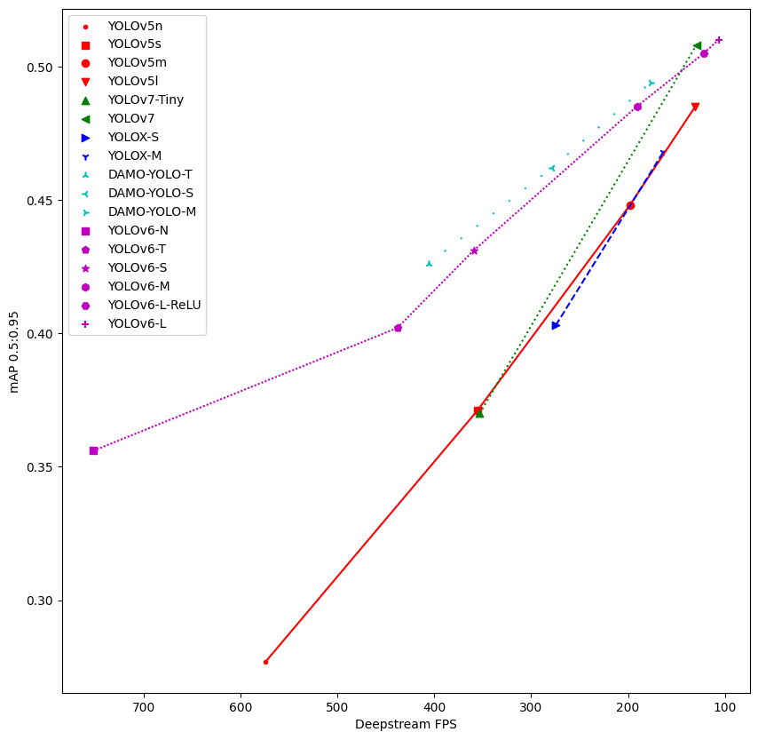

# Benchmark

    

| model       | type nms     | Image size | type code      | FPS    | mAPval 0.5:0.95 | mAPval 0.5 | Command                                             |
| ----------- | ------------ | ---------- | -------------- | ------ | ----------------------- | ------------------ | --------------------------------------------------- |
| YOLOv5n     | EfficientNMS | 640        | deepstream-app | 549.38 | 0.277                   | 0.45               | `deepstream-app -c ./yolov5n-efficient-nms.txt`     |
| YOLOv5s     | EfficientNMS | 640        | deepstream-app | 349.38 | 0.371                   | 0.561              | `deepstream-app -c ./yolov5s-efficient-nms.txt`     |
| YOLOv5m     | EfficientNMS | 640        | deepstream-app | 194.37 | 0.448                   | 0.633              | `deepstream-app -c ./yolov5m-efficient-nms.txt`     |
| YOLOv5l     | EfficientNMS | 640        | deepstream-app | 123.38 | 0.485                   | 0.666              | `deepstream-app -c ./yolov5l-efficient-nms.txt`     |
| YOLOv7-Tiny | BatchedNMS   | 640        | deepstream-app | 275.92 | 0.37                    | 0.546              | `deepstream-app -c ./yolov7-tiny-batched-nms.txt`   |
| YOLOv7-Tiny | EfficientNMS | 640        | deepstream-app | 369.57 | 0.37                    | 0.546              | `deepstream-app -c ./yolov7-tiny-efficient-nms.txt` |
| YOLOv7      | EfficientNMS | 640        | deepstream-app | 125.77 | 0.508                   | 0.69               | `deepstream-app -c ./yolov7-efficient-nms.txt`      |
| YOLOX-S     | EfficientNMS | 640        | deepstream-app | 282.59 | 0.403                   | 0.591              | `deepstream-app -c ./yolox-s-efficient-nms.txt`     |
| YOLOX-M     | EfficientNMS | 640        | deepstream-app | 161.70 | 0.468                   | 0.653              | `deepstream-app -c ./yolox-m-efficient-nms.txt`     |
| YOLOX-Nano  | EfficientNMS | 416        | deepstream-app | 619.27 | 0.257                   | 0.416              | `deepstream-app -c ./yolox-nano-efficient-nms.txt`  |
| YOLOX-Tiny  | EfficientNMS | 416        | deepstream-app | 600.67 | 0.328                   | 0.506              | `deepstream-app -c ./yolox-tiny-efficient-nms.txt`  |
