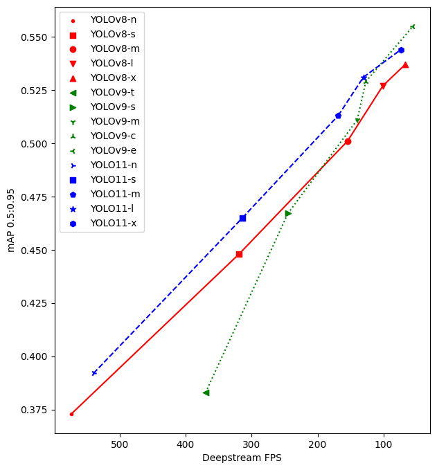
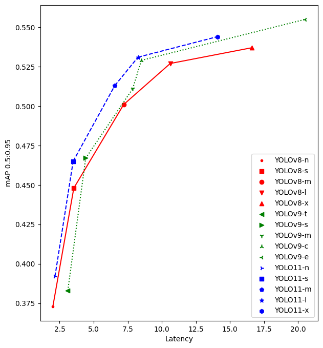
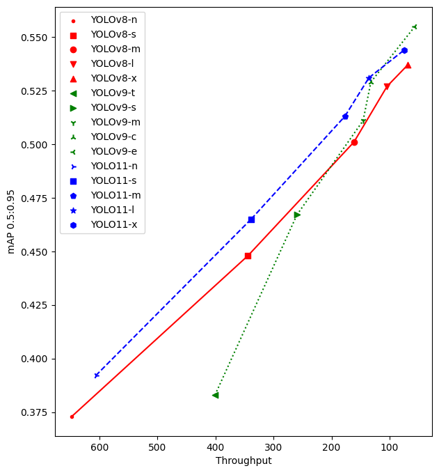

# Benchmark

Test deepstream [fps](./fps/) and [mAP](./map/) in state-of-the-art yolo series model on T4

    

    

    

| model    | type nms     | Image size | FPS    | Latency (99%) | Throughput (qps) | mAPval 0.5:0.95 | mAPval 0.5 |
| -------- | ------------ | ---------- | ------ | ------------- | ---------------- | ----------------------- | ------------------ |
| YOLOv8-n | EfficientNMS | 640        | 572.67 | 2.00586       | 647.276          | 0.373                   | 0.526              |
| YOLOv8-s | EfficientNMS | 640        | 318.91 | 3.54181       | 343.913          | 0.448                   | 0.617              |
| YOLOv8-m | EfficientNMS | 640        | 154.71 | 7.20209       | 161.416          | 0.501                   | 0.671              |
| YOLOv8-l | EfficientNMS | 640        | 101.09 | 10.617        | 104.364          | 0.527                   | 0.697              |
| YOLOv8-x | EfficientNMS | 640        | 67.22  | 16.6089       | 68.6962          | 0.537                   | 0.707              |
| YOLOv9-t | EfficientNMS | 640        | 369.57 | 3.10204       | 400.717          | 0.383                   | 0.531              |
| YOLOv9-s | EfficientNMS | 640        | 245.04 | 4.41357       | 259.683          | 0.467                   | 0.631              |
| YOLOv9-m | EfficientNMS | 640        | 140.00 | 7.8609        | 145.698          | 0.511                   | 0.678              |
| YOLOv9-c | EfficientNMS | 640        | 126.93 | 8.49884       | 132.231          | 0.529                   | 0.701              |
| YOLOv9-e | EfficientNMS | 640        | 55.35  | 20.5296       | 56.3059          | 0.555                   | 0.727              |
| YOLO11-n | EfficientNMS | 640        | 539.31 | 2.15894       | 606.265          | 0.392                   | 0.551              |
| YOLO11-s | EfficientNMS | 640        | 313.79 | 3.49353       | 338.597          | 0.465                   | 0.635              |
| YOLO11-m | EfficientNMS | 640        | 168.75 | 6.55048       | 177.052          | 0.513                   | 0.682              |
| YOLO11-l | EfficientNMS | 640        | 130.65 | 8.25171       | 135.618          | 0.531                   | 0.699              |
| YOLO11-x | EfficientNMS | 640        | 73.69  | 14.0748       | 74.572           | 0.544                   | 0.714              |
